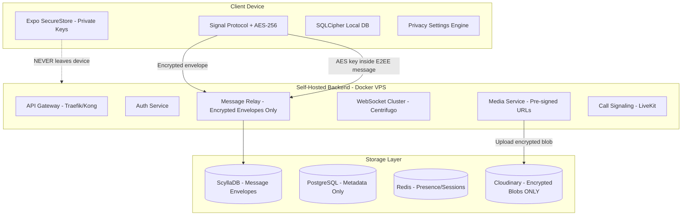
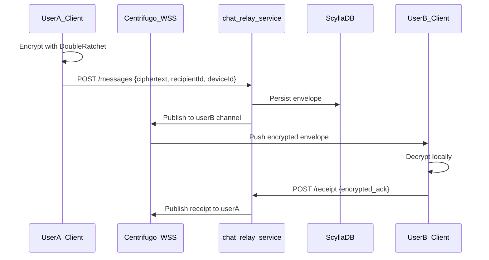

# AuraTalk — Privacy-First Chat App: System Design Plan

> **Project:** Otakuz / AuraTalk  
> **Stack:** Expo React Native (TypeScript) + Self-hosted Docker + Cloudinary (encrypted blobs)  
> **Goal:** Zero-knowledge E2EE chat app, scalable to 1M req/sec architecture

---

## Executive Recommendation: Expo React Native (TypeScript)

**Verdict: Expo React Native with Custom Development Build** — Flutter reject nahi, lekin aapki team JS/TS hai isliye ye clear winner hai.

| Factor | Expo RN + TS | Flutter |
|--------|--------------|---------|
| Team fit | Native JS/TS — backend bhi same language | Dart seekhna padega |
| E2EE libs | `@privacyresearch/libsignal-protocol-typescript`, Web Crypto | FFI / less mature Signal bindings |
| Shared code | Monorepo me crypto types, API contracts, validation share | Alag ecosystem |
| UI mockup (AuraTalk) | Fast iteration, React component model | Strong, par learning curve |
| FLAG_SECURE / screenshot | `expo-screen-capture`, custom config plugin | `screen_protector` — equally good |
| WebRTC calls | `react-native-webrtc` + LiveKit SDK | `flutter_webrtc` — equally good |
| Blur chat | `expo-blur` / `@react-native-community/blur` | `BackdropFilter` built-in |

**Important:** Expo Go se ye app nahi chalegi. Privacy + WebRTC + native security ke liye **Expo Development Build** (`expo-dev-client`) mandatory hai.

---

## Core Architecture Principle: Zero-Knowledge



**Developer (aap) bhi messages nahi padh sakte** — sirf tab jab architecture sahi ho:
- Server par **sirf ciphertext** store hota hai (Signal Protocol envelopes)
- Private keys **device par** (`expo-secure-store` + hardware keystore)
- Media: client-side AES-256 encrypt → Cloudinary par gibberish blob → decryption key E2EE message ke andar
- Server logs me message body **kabhi log nahi** — structured audit without payload

---

## High-Level System Components

```mermaid
flowchart LR
  subgraph mobile [Expo RN App]
    Home[Home Tab]
    Zones[Zones Tab]
    Chats[Chats Tab]
    Calls[Calls Tab]
    Profile[Profile + Privacy Settings]
  end

  subgraph services [Microservices - Docker Compose]
    auth_svc[auth-service]
    user_svc[user-service]
    chat_svc[chat-relay-service]
    group_svc[group-service]
    zone_svc[zone-service]
    story_svc[story-service]
    media_svc[media-service]
    call_svc[call-signaling-service]
    notify_svc[notification-service]
    presence_svc[presence-service]
  end

  mobile -->|"HTTPS + WSS"| services
```



### Service Responsibilities

| Service | Responsibility | Stores Plaintext? |
|---------|----------------|---------------------|
| `auth-service` | Phone OTP verify, JWT issue, device registration | No — phone hash only |
| `user-service` | Profile metadata, public key bundles (pre-keys) | No — keys are public |
| `chat-relay-service` | 1:1 message envelope routing + delivery receipts | **Never** — ciphertext only |
| `group-service` | Group membership, sender-key distribution | Metadata + encrypted group state |
| `zone-service` | Broadcast channels (Tech Updates mockup jaisa) | Encrypted posts only |
| `story-service` | 24h ephemeral encrypted stories | Encrypted blobs + TTL |
| `media-service` | Cloudinary upload token, encrypted blob metadata | Blob refs only |
| `call-signaling-service` | WebRTC SDP exchange via LiveKit | Signaling only — media E2E via DTLS-SRTP |
| `presence-service` | Online/offline, typing indicators (optional off) | Ephemeral Redis |
| `notification-service` | FCM push — **no message content** in payload | Push tokens only |

---

## E2EE Cryptography Design (Signal Protocol)

Research PDF ke hisaab se — ye implementation exact honi chahiye:

### 1:1 Chat
- **X3DH** key agreement on first message
- **Double Ratchet** for forward secrecy
- Library: [`@privacyresearch/libsignal-protocol-typescript`](https://github.com/privacyresearch/libsignal-protocol-typescript) (client) + minimal pre-key server storage

### Group Chat (Design Team, Family Group)
- **Sender Keys** protocol (WhatsApp/Signal model)
- Har member apna sender key distribute karta hai — server sirf encrypted key distribution packets relay karta hai
- Group admin rotate sender key on member remove

### Zones (Broadcast Channels)
- Zone owner ka **zone signing key** + per-subscriber **wrapped content keys**
- Subscribers sirf read — reply restricted (mockup: megaphone icon = one-way)
- Fan-out: publisher encrypts once with symmetric key, key har subscriber ke public key se wrap

### Media / Files / Photos
```
1. Client generates random AES-256-GCM key + IV
2. File encrypt locally → upload encrypted blob to Cloudinary (unsigned upload via media-service token)
3. E2EE message contains: { cloudinaryPublicId, aesKey, iv, mimeType, downloadPolicy }
4. Recipient decrypts locally — Cloudinary ko key kabhi nahi milti
```

### Calls (Voice/Video)
- **LiveKit** self-hosted SFU (Docker) — open source, free for dev/self-host
- WebRTC media: **DTLS-SRTP** (transport encrypted)
- Optional upgrade: Insertable Streams for true E2E media (Phase 2 — complex)

---

## Privacy Features — Technical Implementation

Research PDF + aapke requirements — har feature ka exact mechanism:

### Privacy Settings Screen (User Control Center)

User ke paas **Profile tab → Privacy Settings** me ye toggles:

| Setting | Default | Implementation |
|---------|---------|----------------|
| Chat blur | Off | `expo-blur` overlay on chat list + active chat; instant toggle |
| Prevent screenshots | Off | Android: `FLAG_SECURE` via config plugin; iOS: detect + overlay |
| Block screen recording | Off | iOS `UIScreen.isCaptured` listener → hide/blur content |
| Allow file download | On (per chat override) | Client hides save/share; encrypted blob useless without key anyway |
| Allow photo save | On | Same + `MediaLibrary` permission denied when off |
| Read receipts | On | Encrypted receipt envelopes — user can disable sending |
| Typing indicators | On | Presence service respects opt-out flag |
| Online status visibility | Everyone | Stored as encrypted preference sync |
| Story view privacy | Contacts | Story ACL in encrypted metadata |
| Notify on screenshot | On | Screenshot event → E2EE notification to sender |
| Accessibility service warning | On | Android: detect untrusted a11y services → warn/limit |

**Architecture:** Privacy preferences = encrypted blob synced via `user-service` (ciphertext). Server ko settings ka plaintext nahi pata — sirf sync relay.

### Chat Blur
- UI layer only — security through obscurity nahi, UX privacy hai
- `BlurView` intensity 80-100 on chat list previews + message bubbles when enabled
- App background par auto-blur (AppState listener)

### Download Disable
- **Client enforcement:** No save button, no share sheet, `FLAG_SECURE` on media viewer
- **Server hint:** `downloadPolicy: "view_only"` in encrypted metadata — recipient client enforce kare
- Encrypted blob without AES key = already useless on Cloudinary

### Screenshot Prevention
- Android: [`expo-screen-capture`](https://docs.expo.dev/versions/latest/sdk/screen-capture/) → `preventScreenCaptureAsync()`
- iOS: Full block impossible (Apple limitation) — **detect + blur + notify sender** (Snapchat model)
- Research PDF: Accessibility service detection on Android — Phase 2 native module

---

## AuraTalk UI → Screen Map (Mockup Aligned)

Bottom nav mockup se:

| Tab | Screens | Backend Services |
|-----|---------|------------------|
| **Home** | Feed, recent activity, pinned zones | `zone-service`, `story-service` |
| **Zone** | Create/join zones, Tech Updates-style channels | `zone-service` |
| **Chats** | Chat list (mockup), search, filter, FAB new chat | `chat-relay`, `group-service` |
| **Calls** | Call history, initiate voice/video | `call-signaling`, LiveKit |
| **Profile** | Avatar, Privacy Settings, account | `user-service`, `auth-service` |

Header camera icon → **Stories composer** (`story-service`)

Chat list features from mockup:
- Online green dot → `presence-service` (Redis TTL)
- Unread badges → per-device encrypted counter sync
- Pin icon → user preference (local + sync)
- Mute icon → notification-service opt-out
- Read receipts (✓✓) → optional encrypted receipts

---

## Authentication: Phone OTP

### Production Path
- Phone number → OTP via **MSG91** (India — generous free trial credits) ya **Twilio Verify** (trial)
- Server stores: `phone_hash = SHA256(phone + salt)` — raw number optional encrypted

### Development Path (Free, Dummy)
```
POST /auth/request-otp  { phone: "+919876543210" }
→ Always returns success
→ Dev OTP fixed: "123456" (env: DEV_OTP_CODE)
→ Whitelist dev numbers in auth-service config
```

No paid service needed during development.

### Token Model
- Short-lived JWT (15 min) + refresh token (30 days, rotatable)
- Device-bound: each device registers Signal pre-key bundle on login
- Multi-device: separate key bundle per device (Signal multi-device model simplified)

---

## Backend Tech Stack (Self-Hosted Docker)

### Languages & Frameworks
- **Primary:** Node.js + **Fastify** (TypeScript) — high throughput, schema validation
- **Hot paths (optional Phase 2):** Go microservice for message relay if Node bottleneck
- **Monorepo:** Turborepo — `apps/mobile`, `apps/gateway`, `packages/crypto`, `packages/proto`

### Infrastructure (Single VPS → Multi-Node)

**Phase 0 — Dev (Docker Compose on local / single VPS ~$5-10/mo Hetzner):**

```yaml
services:
  traefik          # Reverse proxy + TLS
  auth-service
  chat-relay-service
  user-service
  media-service
  presence-service
  notification-service
  centrifugo       # WebSocket server (handles 100k+ conn per node)
  livekit          # WebRTC SFU
  postgres
  redis
  scylladb         # Or start with PostgreSQL + partition, migrate later
```

**Phase 1 — Production VPS cluster:**
- 3+ VPS nodes behind load balancer
- ScyllaDB 3-node cluster (message store)
- Redis Sentinel cluster
- Centrifugo horizontal scale with Redis broker

### Cloudinary Integration (Encrypted Media Only)
- **Upload:** Client gets short-lived signed upload preset from `media-service`
- Client uploads **already encrypted** file bytes
- Cloudinary stores with `resource_type: raw` (not image processing — no plaintext leak)
- **Never** enable Cloudinary AI/analysis on bucket
- CDN delivery: encrypted blob URL → client decrypts locally
- Free tier: 25 credits/month — dev ke liye kaafi

---

## Real-Time Messaging Architecture



- **WebSocket:** Centrifugo (Go, battle-tested, Redis-backed)
- **Fallback:** Long polling for restrictive networks
- **Offline delivery:** Envelope queue in ScyllaDB, deliver on reconnect
- **Push notification:** FCM data-only — `"You have a new message"` (no preview unless user enables)

---

## 1M Requests/Second — Scalable-by-Design (Day One)

**Reality check:** 1M req/sec = ~86 billion requests/day. Day one par ye traffic nahi hogi — lekin **architecture aise design karo ke horizontal scale bina rewrite ke ho**.

### Design Decisions for Scale

| Layer | Day-One Choice | Scale Path |
|-------|----------------|------------|
| API Gateway | Traefik → Kong/Nginx | Multi-region anycast |
| Stateless services | All stateless containers | K8s HPA / Docker Swarm replicas |
| Message writes | ScyllaDB (partition by conversationId) | Add nodes, no resharding pain |
| Message reads | Read replicas + Redis cache of recent envelopes | CQRS read models |
| WebSocket | Centrifugo cluster | 1 node = ~500k connections |
| Async work | **NATS JetStream** (self-hosted, free) | Fan-out, push, receipts |
| Rate limiting | Redis sliding window per user/IP | Edge rate limit (Traefik) |
| Media | Cloudinary CDN | Encrypted blobs cache at edge |

### Partition Strategy (ScyllaDB)
```
PRIMARY KEY ((conversation_id), message_id, timestamp)
→ All messages in one chat = same partition → ordered reads
→ Hot conversations: sub-partition by bucket (conversation_id + day)
```

### Event-Driven Decoupling
```
message.sent → NATS → [push-worker, receipt-worker, analytics-worker]
```
Har service independently scale — 1M/sec ingest via NATS buffering.

### Load Estimate Mapping
- 1M req/sec mixed traffic ≈ 10-20M concurrent WebSocket connections globally
- ~50-100 Centrifugo nodes + ~200 API replicas (rough WhatsApp-tier math)
- **Day one:** Single VPS handles ~5-10k concurrent users — architecture same, smaller infra

---

## Data Models (Server — Metadata Only)

### PostgreSQL Tables
- `users` — id, phone_hash, created_at
- `devices` — user_id, device_id, identity_key_public, registration_id
- `pre_keys` — device_id, pre_key_bundle (public keys only)
- `conversations` — id, type (direct|group|zone), created_at
- `conversation_members` — conversation_id, user_id, role, joined_at

### ScyllaDB Tables
- `message_envelopes` — conversation_id, message_id, sender_device, ciphertext, timestamp, ttl
- `offline_queue` — recipient_id, envelope_ref, created_at

### Redis Keys
- `presence:{userId}` — TTL 60s
- `typing:{conversationId}:{userId}` — TTL 5s
- `session:{deviceId}` — JWT session
- `rate:{userId}` — rate limit counter

**Server NEVER has:** message plaintext, AES media keys, private keys, phone numbers in plaintext (only hash)

---

## Project Structure (Monorepo)

```
otakuz/
├── apps/
│   ├── mobile/                 # Expo RN (AuraTalk UI)
│   ├── auth-service/
│   ├── chat-relay-service/
│   ├── user-service/
│   ├── media-service/
│   ├── group-service/
│   ├── zone-service/
│   ├── story-service/
│   └── call-signaling-service/
├── packages/
│   ├── crypto/                 # Shared Signal + AES helpers
│   ├── proto/                  # API types / OpenAPI
│   ├── privacy-engine/         # Blur, screenshot, download policy
│   └── ui/                     # Shared design tokens (AuraTalk theme)
├── infra/
│   ├── docker-compose.yml
│   ├── docker-compose.prod.yml
│   ├── traefik/
│   └── scylla/
└── docs/
    └── architecture/
```

---

## Free Development Stack Summary

| Component | Free Choice |
|-----------|-------------|
| Mobile | Expo (free) + Android emulator |
| Backend hosting | Hetzner CX22 (~€4/mo) OR local Docker |
| Database | PostgreSQL + ScyllaDB (self-hosted) |
| Cache | Redis (self-hosted) |
| WebSocket | Centrifugo (OSS) |
| Calls | LiveKit (OSS, self-hosted) |
| Media | Cloudinary free tier (encrypted blobs) |
| Push | Firebase FCM (free) |
| OTP (dev) | Fixed OTP `123456` — no vendor |
| OTP (staging) | MSG91 free trial |
| CI | GitHub Actions free tier |
| Monitoring | Grafana + Prometheus (self-hosted) |

**Total dev cost:** ~$0 local, ~$5-10/mo single VPS for staging.

---

## Phased Delivery Roadmap

### Phase 1 — MVP (Weeks 1-8): Trust Foundation
- Monorepo scaffold + Docker Compose
- OTP auth (dev dummy)
- Signal Protocol 1:1 E2EE chat
- AuraTalk Chats tab UI (mockup)
- Privacy Settings screen (blur, screenshot, download toggles)
- Encrypted media upload to Cloudinary
- Centrifugo real-time delivery

### Phase 2 — Social Core (Weeks 9-14)
- Groups (sender keys)
- Voice/video calls (LiveKit)
- Read receipts, typing, presence
- Reply-to-message, reactions

### Phase 3 — AuraTalk Full UI (Weeks 15-20)
- Zones (broadcast channels)
- E2EE Stories (24h TTL)
- Home tab feed
- Calls tab history
- Search + filter (mockup)

### Phase 4 — Hardening & Scale (Weeks 21+)
- ScyllaDB migration from PG message store
- NATS JetStream event bus
- Multi-node Docker Swarm
- Accessibility service detection (Android)
- Security audit + open-source client crypto package

---

## Implementation Todos

- [ ] Turborepo monorepo: apps/mobile (Expo dev client), packages/crypto, infra/docker-compose.yml
- [ ] auth-service: phone OTP with dev fixed code 123456, JWT + device registration, phone_hash storage
- [ ] packages/crypto + chat-relay-service: Signal Protocol X3DH + Double Ratchet, ScyllaDB/PG envelope store
- [ ] Centrifugo WSS integration: message delivery, presence, typing indicators with privacy opt-out
- [ ] media-service: client-side AES-256 encrypt, Cloudinary raw blob upload, key in E2EE message only
- [ ] Privacy Settings screen + privacy-engine: blur, FLAG_SECURE, download block, screenshot notify
- [ ] AuraTalk Chats tab UI from mockup: list, search, filter, FAB, badges, pin, mute
- [ ] group-service: Sender Keys protocol for multi-party E2EE groups
- [ ] call-signaling-service + LiveKit Docker: voice/video WebRTC
- [ ] zone-service + story-service: broadcast zones, 24h E2EE stories, Home tab
- [ ] NATS JetStream event bus + ScyllaDB cluster config for horizontal scale path

---

## Security Checklist (Non-Negotiable)

- [ ] Private keys never transmitted to server
- [ ] Server logs strip ciphertext (log only IDs + timestamps)
- [ ] TLS 1.3 everywhere (Traefik auto Let's Encrypt)
- [ ] Certificate pinning in mobile app
- [ ] SQLCipher for local message DB on device
- [ ] Root/jailbreak detection → warn user (optional restrict)
- [ ] No message content in FCM push payloads
- [ ] Cloudinary bucket: no transformations, raw encrypted upload only
- [ ] Rate limiting on OTP endpoint (prevent SMS abuse in prod)
- [ ] GDPR-style account delete → wipe server metadata + queued envelopes

---

## Key Risks & Honest Limits

1. **Screenshot on iOS:** 100% block impossible — detect + notify is industry standard
2. **Web blur/screenshot:** Browser me full protection nahi — mobile-first MVP sahi hai
3. **1M req/sec:** Architecture ready ≠ infra ready — scale infra with traffic, not rewrite
4. **True zero-knowledge:** Requires disciplined coding — koi bhi debug log ya admin panel me decrypt mat add karna
5. **Group E2EE:** Sender Keys complex hai — Phase 2 me implement, MVP me 1:1 pe focus

---

## Recommended First Implementation Step

Jab aap plan approve karein, pehla kaam:

1. Turborepo monorepo init
2. `docker-compose.yml` with Postgres, Redis, Centrifugo, Traefik
3. Expo app with AuraTalk Chats screen (mockup pixel-close)
4. `auth-service` with dev OTP `123456`
5. `packages/crypto` with Signal Protocol key generation test

Isse architecture validate ho jayegi bina poori app likhe.
